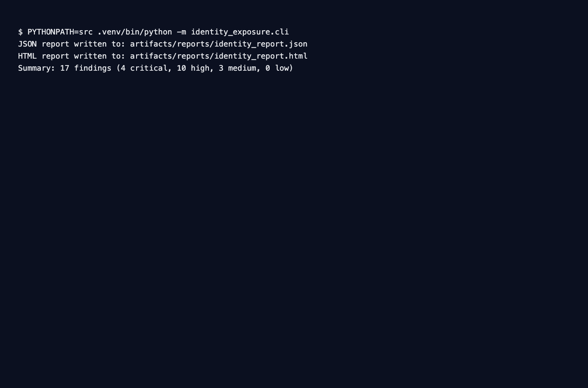
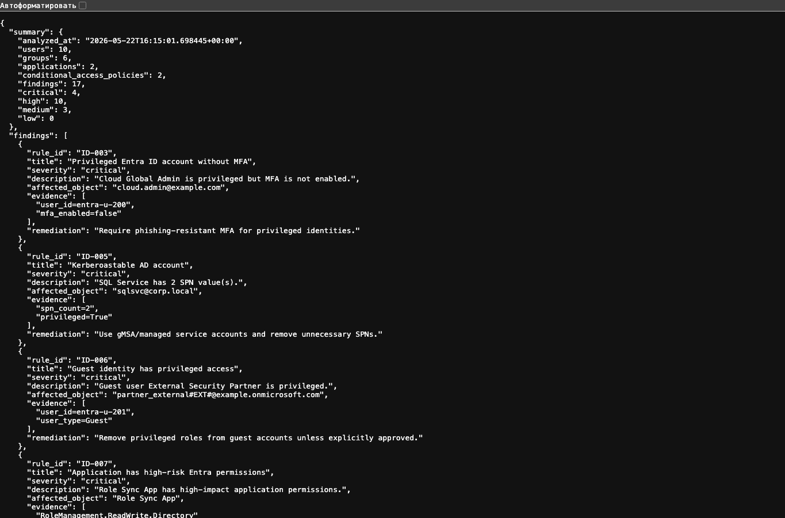
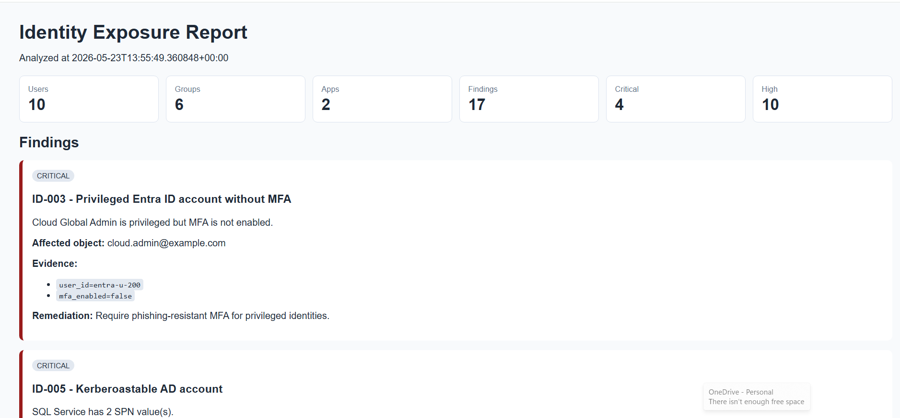
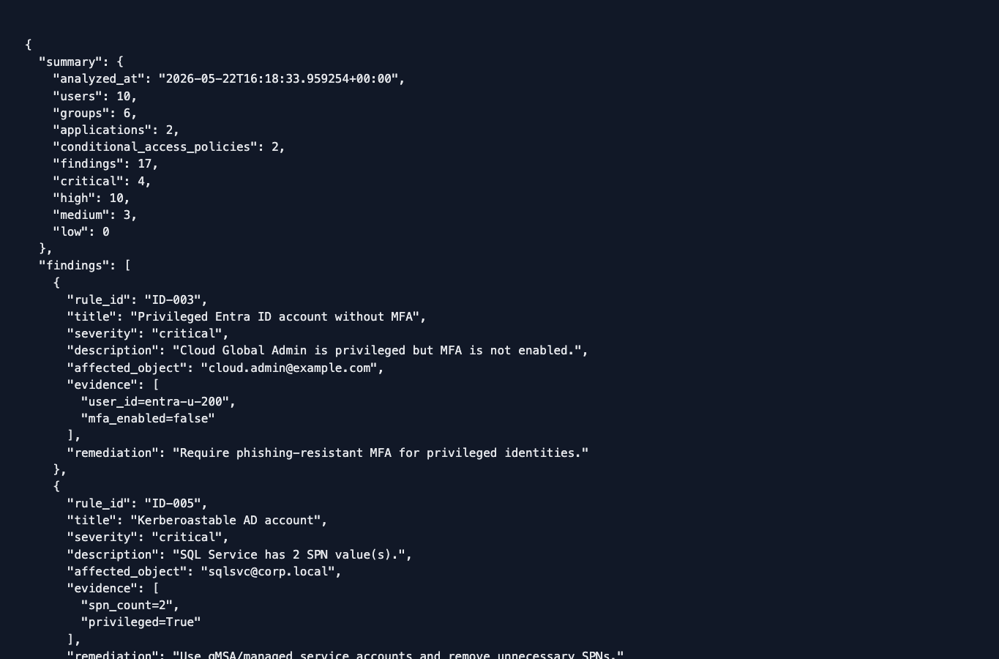
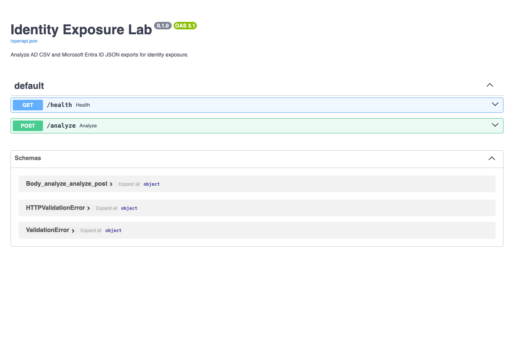

# Identity Exposure Lab

Identity Exposure Lab is a Python-based identity security analysis platform that detects risky configurations, privilege exposures, and insecure identity relationships across hybrid Active Directory and Microsoft Entra ID environments.

The project ingests AD-style CSV exports and Entra ID-style JSON exports, normalizes identities and permissions into a unified internal model, builds identity relationship graphs, and applies security detection rules to identify privilege escalation paths, stale identities, MFA gaps, high-risk application permissions, and other common identity security weaknesses.

The system was designed to simulate real-world identity security and IAM assessment workflows used by blue teams, cloud security engineers, and identity-focused security analysts. It combines graph-based privilege analysis, rule-based detections, API-driven analysis, and report generation into a single security assessment pipeline.

Identity Exposure Lab supports both CLI-based execution and a FastAPI upload interface that generates structured JSON findings and HTML security reports from uploaded identity datasets.

## Detection Rules

| Rule ID | Detection | Severity |
|---|---|---|
| `ID-001` | Disabled privileged account still has privileged assignment | Medium |
| `ID-002` | Stale privileged identity | High |
| `ID-003` | Privileged Entra ID account without MFA | Critical |
| `ID-004` | Password never expires | Medium / High |
| `ID-005` | Kerberoastable AD account with SPN | High / Critical |
| `ID-006` | Guest identity has privileged access | Critical |
| `ID-007` | Application has high-risk Entra permissions | High / Critical |
| `ID-008` | Stale application secret | Medium |
| `ID-009` | No enabled tenant-wide MFA Conditional Access policy | High |
| `ID-010` | Non-privileged identity has path to privileged object | High |

## Inputs

```text
sample_data/ad_users.csv
sample_data/ad_groups.csv
sample_data/entra_export.json
```

## Run

**Create virtual environment**

python -m venv .venv

**Activate environment**

*Linux/macOS*
source .venv/bin/activate

*Windows PowerShell*
.\.venv\Scripts\Activate.ps1

**Install project**

pip install -e ".[dev]"

**Run CLI**

python -m identity_exposure.cli

**Run tests**

pytest

**Custom files**

```bash
identity-exposure --ad-users sample_data/ad_users.csv --ad-groups sample_data/ad_groups.csv --entra-export sample_data/entra_export.json
```

## Screenshots

These screenshots are from the real CLI run, generated JSON/HTML reports, the running FastAPI Swagger UI, and a real `/analyze` response created from the sample files.

To reproduce the same views:

```bash
PYTHONPATH=src python -m identity_exposure.cli
PYTHONPATH=src uvicorn identity_exposure.api.main:app --reload
curl \
  -F "ad_users=@sample_data/ad_users.csv;type=text/csv" \
  -F "ad_groups=@sample_data/ad_groups.csv;type=text/csv" \
  -F "entra_export=@sample_data/entra_export.json;type=application/json" \
  http://localhost:8000/analyze
```

Then open `artifacts/reports/identity_report.html`, `artifacts/reports/identity_report.json`, and `http://localhost:8000/docs`.

CLI analysis:




JSON findings:




HTML report:




API upload response:




FastAPI docs:




## Findings Covered

- Disabled privileged accounts.
- Stale privileged identities.
- Privileged cloud accounts without MFA.
- Passwords set to never expire.
- SPN-backed service accounts.
- Guest identities with privileged access.
- High-risk application permissions.
- Stale application secrets.
- Missing tenant-wide MFA Conditional Access coverage.
- Non-privileged paths to privileged objects.

## API Mode

```bash
uvicorn identity_exposure.api.main:app --reload
```

Open `http://localhost:8000/docs` and upload the three sample files to `POST /analyze`.

## Layout

```text
src/identity_exposure/ingest/       CSV and JSON loaders
src/identity_exposure/detection/    identity risk rules
src/identity_exposure/graph/        exposure path traversal
src/identity_exposure/reporting/    report writers
artifacts/reports/                  generated JSON and HTML reports
```

Keywords: identity security, active directory, entra id, graph analysis, fastapi, pytest
